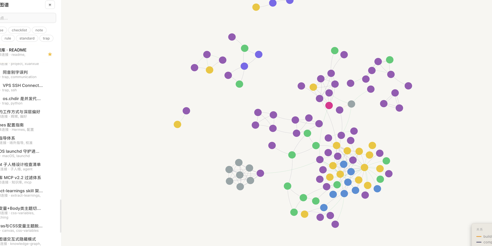

<div align="center">
  
  <h1>Knowledge Vault 🏛️</h1>
  <p>个人知识库搭建方案 —— 从数据结构到应用体系</p>
  <p><em>SQLite · FTS5 · 三层分层 · 语义关系 · 向量检索</em></p>
  <br>
  <p>
    
    
    
  </p>
</div>

---

## 为什么要做这个？

知识积累久了会散——这个 Obsidian，那个对话记录，还有随手存的代码片段。需要的不只是多一个文件夹来存，而是一套**结构化的知识组织体系**：知道什么该记、怎么分类、如何关联、积累到什么时候该升格。

所以有了这个项目：一个**本地优先、隐私保护**的个人知识库系统，核心是 SQLite 层面的数据结构和组织方法论。知识图谱可视化只是它的一种应用方式。

---

## ✨ 核心能力

| 能力 | 说明 | 状态 |
|------|------|------|
| **本地优先** | 所有数据存在 SQLite 里，不依赖任何云服务 | ✅ 全量开源 |
| **三级分层** | L0 铁律 → L1 认知校准器 → L2 知识记录库，三层隔离防止认知污染 | ✅ 全量开源 |
| **关系类型体系** | 10 种语义边（引用/使用/扩展/矛盾/相似...），关系不只是一种 | ✅ 全量开源 |
| **双擎搜索** | FTS5 全文搜索 + BGE 语义向量搜索，关键词和语义双重覆盖 | ✅ 全量开源（语义搜索需 `pip install fastembed`） |
| **CLI + MCP** | 命令行工具 + MCP 协议服务器，可被任何 AI Agent 调用 | ✅ 全量开源 |
| **夜间自动维护** | Dream Cycle 定时重建索引、合并清理、写入日志 | 🔒 私有部署 |

---

## 📦 知识库核心设计

### 1. 三级分层体系（L0 / L1 / L2）

一个库，两种用途，三层隔离。核心边界：不是信息越多越好，而是**信息不能跨层越权**。

| 层 | 作用 | 写入原则 |
|----|------|----------|
| **L2 知识记录库** | 存资料、想法、项目背景、小说设定、工具经验、行业信息 | **尽管装**。它是仓库、书房、杂物间、灵感收纳箱 |
| **L1 认知校准器** | 存会影响 Agent 判断和行为的规则、偏好、教训、决策边界 | **慎重提炼**。只有经过验证、反复使用、确实会影响行为的知识才升级到 L1 |
| **L0 铁律** | Agent 的人格底线、不可违反的底层规则 | **极少写入**。只有"几乎不该变"的才放这里 |

**跨层原则：** L2 随便记 → 反复出现、验证有效 → L1 方法/规则 → 几乎不该变 → L0 铁律。

真正要避免的不是"记录知识太多"，而是**参考资料不小心变成行为准则**。存一篇文章说"某某做法很好"是资料；但如果系统把它当成"用户一定认同这个做法"，就是认知污染。

### 2. 关系类型体系

定义 10 种语义边，每条连接都带有明确含义：

| 关系类型 | 语义 | 自动推断条件 |
|----------|------|-------------|
| `references` | 通用引用 | 标签有重叠 |
| `related_to` | 泛关联 | 仅标题重叠 |
| `uses` | 使用关系 | tag 含"tool/cli/API" |
| `builds_on` | 扩展/升级 | 标题含"V{数字}/升级" |
| `contradicts` | 矛盾 | — |
| `similar_to` | 相似 | 同 domain + 共同 tag |
| `part_of` | 子集 | — |
| `works_at` | 工作关系 | tag 含"公司/项目" |
| `created` | 创建关系 | — |
| `mentions` | 提及 | — |

**自动与手动隔离：** 自动推断的关联和手动创建的关联用 `link_source` 字段隔离，重建时不混肴。

### 3. 双擎搜索

- **FTS5 全文索引** — SQLite 内置，无外部依赖，支持中文分词
- **BGE 语义向量** — 512 维嵌入，基于 `BAAI/bge-small-zh-v1.5`
- **混合策略** — 先用 FTS5 精确匹配，无结果时回退到语义搜索

### 4. 条目格式

每个知识条目采用双层结构：

```markdown
## 当前理解（Compiled Truth）
当前最佳结论。随知识积累可覆盖更新。
保留最新的综合理解，不保留旧版本。

## 证据链（Timeline）
- **2026-06-26** | [Source: 对话记录] — 原始证据
- **2026-06-25** | [Source: 文档] — 另一证据

## Why（选填）
为什么要做这个决策，有什么上下文？
```

### 5. 数据库 Schema

核心表结构（完整定义见 `schema.sql`）：

| 表 | 用途 |
|:---|:-----|
| `notes` | 笔记主体（标题、内容、类型、层级、领域、置信度、标签文本、使用统计） |
| `tags` / `note_tags` | 标签体系，多对多关联 |
| `links` | 有向语义边（类型、上下文、来源） |
| `note_links` | 兼容的双向关联表 |
| `note_embeddings` | 向量嵌入存储 |
| `notes_fts` | FTS5 全文搜索虚拟表（触发器自动同步） |

---

## 🚀 快速开始

### 前置要求

- Python 3.10+
- SQLite 3（系统自带）

### 安装

```bash
git clone https://github.com/HuiHuitie-zhu/knowledge-vault.git
cd knowledge-vault
pip install -r requirements.txt
python3 vault.py init
```

### 基本用法

```bash
# 添加一条笔记
python3 vault.py add "Python 装饰器" "装饰器是修改函数行为的函数..." --tags python,技巧 --type reference

# 添加时建立关联
python3 vault.py add "Functools 模块" "内置高阶函数工具集..." --link-to 1 --link-type uses

# 搜索
python3 vault.py search "装饰器"

# 语义搜索
python3 vault.py search "函数增强" --semantic

# 查看统计
python3 vault.py stats

# 重建索引 + 图谱关联推断
python3 vault.py reindex [--graph]

# 合并检查（查重 + 低质量检测）
python3 vault.py consolidate
```

### 写入分类原则

添加笔记时指定合适的 `--type`：

| type | 用途 |
|:-----|:-----|
| `rule` | 规则、铁律（layer=0） |
| `standard` | 流程标准（layer=1） |
| `trap` | 踩坑记录 |
| `checklist` | 检查清单 |
| `case` | 具体案例 |
| `reference` | 参考资料、配置说明 |
| `doc` | 文档 |
| `note` | 一般笔记（默认） |

---

## 📖 延伸阅读

以下内容与核心知识库设计解耦，单独阅读：

### 知识图谱可视化

这个仓库附带了一个 D3.js + Canvas 2D 的知识图谱前端，支持力导向布局、类型过滤、点击聚焦、日夜切换等功能。

<p align="center">
  
</p>

> **注意：** 这个前端**仅提供设计思路参考**。你完全可以用 D3.js、Sigma.js、vis-network 甚至直接查数据库做自己的可视化。按技术栈和审美来。

启动方式：

```bash
python3 seed.py   # 生成示例数据
python3 server.py # 启动 API + 前端
open http://localhost:51420
```

### 跨 Agent 知识共享

Knowledge Vault 通过 **MCP（Model Context Protocol）** 让多个 Agent 共享同一个知识库：

```
SQLite ←→ MCP 服务器 ←→ Claude Code / Cursor / 自定义 Agent
```

注册方式（`.mcp.json`）：

```json
{
  "mcpServers": {
    "knowledge-base": {
      "command": "python3",
      "args": ["path/to/knowledge_mcp.py"]
    }
  }
}
```

MCP 服务器通过环境变量 `KNOWLEDGE_DB_PATH` 指定数据库路径，默认使用同目录下的 `vault.db`。也可通过 `.env` 文件配置（参见 `.env.example`）。

Agent 通过 MCP 工具直接读写知识库：`knowledge_search` / `knowledge_add` / `knowledge_update` 等。Agent A 写入的经验，Agent B 立刻可查——无需同步、无需复制。

### Dream Cycle 夜间维护

定时（每日凌晨）自动执行：健康检查 → 查重合并 → 重建向量索引 → 图谱关联推断 → 报告写入。

### macOS 原生桌面应用

WKWebView 封装的知识图谱桌面端，双击即用、关闭即停，比 Electron 方案节省约 200MB 内存。

---

## 🛠 技术栈

| 层 | 技术 |
|----|------|
| **存储** | SQLite 3 + FTS5 |
| **全文搜索** | SQLite FTS5 + 中文分词 |
| **语义搜索** | BGE (BAAI/bge-small-zh-v1.5) 512-dim |
| **API 服务器** | Python http.server |
| **CLI 工具** | Python（`vault.py`） |
| **MCP 服务器** | Python（`knowledge_mcp.py`） |
| **图谱前端** | D3.js v7 + Canvas 2D |

---

## 📂 项目结构

```
knowledge-vault/
├── README.md            # 本文档
├── schema.sql           # 数据库 DDL（核心！）
├── vault.py             # CLI 工具（增删查改 + 重建 + 合并）
├── knowledge_mcp.py     # MCP 协议服务器（AI Agent 直接调用）
├── server.py            # HTTP API + 知识图谱前端服务器
├── index.html           # 知识图谱可视化前端（参考实现）
├── seed.py              # 示例数据生成器
├── setup.sh             # 一键安装脚本
├── requirements.txt     # Python 依赖
├── .env.example         # 环境变量配置模板
├── assets/
│   └── icon.svg         # 项目图标
└── LICENSE              # MIT
```

---

## 设计决策

### 为什么 SQLite 而不是 PostgreSQL / Neo4j？

第一原则：**本地优先**。整个知识库在单文件里随身携带，不需要运行数据库服务器。FTS5 是 SQLite 的隐藏杀手锏，全文搜索能力不输 Elasticsearch 的小规模场景。图数据库对 100-1000 级别的节点过度设计——关系型 + 连接表在这个规模上绰绰有余。

### Typed Edges 为什么重要？

大多数知识工具只告诉你"两个东西有关"，但不告诉你怎么关联的。知道 A "引用" B 和知道 A "矛盾" B 是完全不同的信息熵。带语义的边让图谱不只是"好看"，而是可推理的。

### 为什么用 Canvas 2D 而不是 SVG？

当节点数超过 100 时，SVG DOM 节点数会导致浏览器 layout 卡顿。Canvas 2D 把绘制交给 GPU。WebGL（Three.js）在 2D 力导向图场景下大材小用。

---

## 📖 灵感来源

- [GBrain](https://github.com/raymondwzhao/gbrain) — 条目格式（Compiled Truth + Timeline）受此启发
- [Hermes](https://github.com/NousResearch/hermes) — 运行这个系统的 AI Agent 框架

---

## 📄 License

MIT — Built with curiosity, not with a plan.
